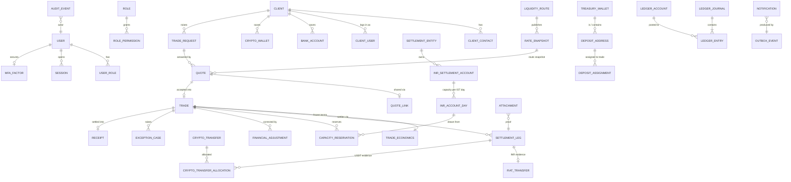

# INRP2P Exchange — Domain Model

Status: Phase 0 draft, for review.
Conventions: ids are UUIDv7 (time-ordered) unless noted; human references (`IX-260916-1842`) are separate unique columns. All timestamps `timestamptz` (UTC stored, IST displayed). Money/rate columns follow `FINANCIAL_INVARIANTS.md §1`. `created_at`, `created_by` on every table; mutable tables also carry `version` (optimistic check) in addition to row locks.

## 1. ERD

## 2. Modules and entities

### 2.1 Identity
| Entity | Key fields | Notes |
|---|---|---|
| `user` | email (unique, citext), display_name, kind (`OPERATOR`,`CLIENT`), status (`ACTIVE`,`DISABLED`), password_hash (argon2id, nullable for passwordless clients) | One table, two kinds; client users link via `client_user` |
| `role` | code (`OWNER`,`DEALER`,`SETTLEMENT_OPERATOR`,`FINANCE`,`SUPPORT`,`READ_ONLY`) | Seeded; custom roles later |
| `permission` / `role_permission` | code e.g. `quote:send` | Matrix in `SECURITY.md §3` |
| `user_role` | user_id, role_id, granted_by | Changes audited |
| `mfa_factor` | user_id, type (`TOTP`), secret (encrypted), confirmed_at | Required for every operator |
| `session` | token_hash, user_id, surface (`CLIENT`,`OPERATOR`), mfa_verified_at, ip, ua, expires_at, revoked_at | Opaque token in cookie; only hash stored |

### 2.2 Clients
| Entity | Key fields |
|---|---|
| `client` | ref (`CL-0042`), legal_name, display_name, type (`COMPANY`,`INDIVIDUAL`), status (`ACTIVE`,`SUSPENDED`), typical_direction, typical_size_usdt_minor, pricing_notes (operator-only), kyc_status (placeholder, `DECISIONS.md D-07`) |
| `client_contact` | client_id, name, email, phone, telegram_handle, whatsapp_number, is_primary, notes |
| `client_user` | client_id, user_id, role (`CLIENT_ADMIN`,`CLIENT_TRADER`) |
| `bank_account` (client beneficiary) | client_id, holder_name, bank_name, ifsc, account_number_enc, account_last4, account_hmac, rail_preferences, status (`ACTIVE`,`ARCHIVED`), verified_at | Unique `(client_id, account_hmac)` among ACTIVE. Never edited in place — change = archive + new row (so a quote's target can't silently change) |
| `crypto_wallet` (client) | client_id, network, address, label, purpose (`SOURCE`,`DESTINATION`,`BOTH`), status | Same archive-not-edit rule; unique `(client_id, network, address)` |

Derived (query, not stored): total completed volume, total gross margin, last trade, open trades.

### 2.3 INR Accounts
| Entity | Key fields |
|---|---|
| `settlement_entity` | legal_name, short_name ("Company A"), status |
| `inr_settlement_account` | entity_id, bank_name, account_last4, account_enc, ifsc, rails (`IMPS`,`NEFT`,`RTGS`,`UPI`), direction (`PAYOUT`,`COLLECTION`,`BOTH`), status (`ACTIVE`,`PAUSED`,`UNAVAILABLE`), default_daily_capacity_minor, notes |
| `inr_account_day` | account_id, day (IST date), capacity_minor, used_minor, reserved_minor, pending_payout_minor | PK `(account_id, day)`; created lazily from default; the concurrency anchor for FI-30 |
| `capacity_reservation` | trade_id, account_id, day, amount_minor, status (`ACTIVE`,`CONSUMED`,`RELEASED`), consumed_minor, released_reason | Partially consumable: legs consume, remainder released |

`remaining = capacity − used − reserved` (can be negative only after an audited capacity reduction).

### 2.4 Pricing
| Entity | Key fields |
|---|---|
| `liquidity_route` | name (internal only), direction, asset, network, status, available_base_minor (operator-maintained), notes. **Never** exposed to client APIs |
| `rate_snapshot` | kind (`REFERENCE`,`ROUTE`), route_id (null for reference), direction, rate_micro, source (`OPERATOR`,`FEED:{name}`), effective_at, created_by, supersedes_id | Append-only; "current route rate" = latest by `effective_at` per route+direction |

### 2.5 Quotes
| Entity | Key fields |
|---|---|
| `trade_request` | ref, client_id, direction, fixed_side, requested_base_minor / requested_quote_minor, target_rate_micro (nullable), bank_account_id / crypto_wallet_id (destination), source_wallet_id (SELL expected sender, optional), channel (`CLIENT_APP`,`OPERATOR`,`LINK`), status (`OPEN`,`QUOTED`,`ACCEPTED`,`DECLINED`,`WITHDRAWN`,`EXPIRED`), assigned_dealer_id |
| `quote` | ref, trade_request_id, client_id, direction, fixed_side, base_minor, quote_inr_minor, client_rate_micro, route_rate_micro, route_rate_snapshot_id, route_id, route_value_inr_minor, gross_margin_inr_minor, network, bank_account_id, crypto_wallet_id, valid_for_seconds, sent_at, expires_at, status (`DRAFT`,`SENT`,`ACCEPTED`,`EXPIRED`,`REJECTED`,`CANCELLED`), cancel_reason (`SUPERSEDED`,`DECLINED_BY_DESK`,`WITHDRAWN`,`OPERATOR`), is_counter, negative_margin_reason, created_by, accepted_by_user_id, accepted_via (`APP`,`LINK`), accepted_at |
| `quote_link` | quote_id (unique), token_hash (sha256, unique), created_by, first_opened_at, open_count, revoked_at | Token = 128-bit random, base62 (22 chars). Expires with the quote |

Client-facing projection `ClientQuoteView` is a separate type containing only: ref, direction, base, inr amount, client rate, network, masked target, expires_at, status. It is the only shape the client API and the link page can serialize (enforced by type + test that serialized JSON contains no forbidden keys).

### 2.6 Trades
| Entity | Key fields |
|---|---|
| `trade` | ref (`IX-YYMMDD-NNNN`), quote_id (unique), trade_request_id, client_id, direction, lifecycle_state, hold (bool, derived from open blocking exceptions, stored for queue queries), opened_at, completed_at, cancelled_at |
| `trade_economics` | trade_id (PK), base_minor, quote_inr_minor, client_rate_micro, route_rate_micro, route_value_inr_minor, gross_margin_inr_minor, fees_json (explicit fee lines, V1 empty), network, bank_account_id, crypto_wallet_id, frozen_at | Insert-once |
| `trade_transition` | trade_id, from_state, to_state, command, actor, correlation_id, at | Append-only history (in addition to audit) |
| `financial_adjustment` | trade_id, type (`AMOUNT_CORRECTION`,`RATE_CORRECTION`,`FEE`,`WRITE_OFF`,`REFUND`), delta fields (base, quote_inr, margin), reason, evidence_attachment_ids, requested_by, approved_by (must differ, `SECURITY.md §4`), ledger_journal_id | Effective terms = economics ⊕ Σ approved adjustments |
| `exception_case` | ref, trade_id (nullable: unallocated funds), type (enum §3), severity (`BLOCKING`,`WARNING`), status (`OPEN`,`IN_PROGRESS`,`RESOLVED`,`VOID`), subject_type/subject_id, detected_by (`SYSTEM`,`OPERATOR`), resolution_command, resolution_notes, resolved_by, resolved_at | Unique open case per `(type, subject_type, subject_id)` |

### 2.7 Settlement
`settlement_leg` is the unit of value movement **for a trade**, in either direction.

| Field | Notes |
|---|---|
| trade_id, ref (`IX-…-L3`) | |
| side | `CLIENT_TO_EXCHANGE` (first leg) · `EXCHANGE_TO_CLIENT` (payout) · `REFUND_TO_CLIENT` |
| asset | `INR` or `USDT` |
| amount_minor | Planned amount |
| status | see `STATE_MACHINES.md §4` |
| inr_account_id / capacity_reservation_id | INR legs from exchange |
| destination_bank_account_id / destination_wallet_id | Snapshot of target at creation |
| operator_id, notes, created_at, sent_at, confirmed_at, failed_at, failure_reason | |

| Evidence entity | Key fields |
|---|---|
| `fiat_transfer` | leg_id (unique), rail, utr, utr_normalized, amount_minor, source_account_id, destination (masked snapshot), value_date, recorded_by, proof_attachment_id | Unique `(rail, utr_normalized)` |
| `crypto_transfer` | network, tx_hash, log_index, token_contract, from_address, to_address, amount_minor, block_number, block_time, detected_at, receipt_status, state (`DETECTED`,`CONFIRMED`,`FAILED`,`ORPHANED`), confirmed_at, source (`SCANNER`,`OPERATOR_SUBMITTED`) | Unique `(network, tx_hash, log_index)` |
| `crypto_transfer_allocation` | crypto_transfer_id (unique), settlement_leg_id or exception_case_id, amount_minor, allocated_by | One transfer → one destination; over/short handled by exception, not by splitting silently |
| `attachment` | storage_key, sha256, mime, size, uploaded_by, subject_type/id | Immutable; replacing = new attachment |

### 2.8 Crypto / Treasury
| Entity | Key fields |
|---|---|
| `treasury_wallet` | network, address, label, role (`HOT`,`COLD`,`DEPOSIT_POOL`), status (`ACTIVE`,`PAUSED`,`RETIRED`), custody (`EXTERNAL`), observed_balance_minor, observed_at, reserved_minor |
| `deposit_address` | treasury_wallet_id, address (unique), status (`AVAILABLE`,`ASSIGNED`,`COOLDOWN`,`RETIRED`) |
| `deposit_assignment` | deposit_address_id, trade_id, expected_amount_minor, assigned_at, released_at | Partial unique: one open assignment per address (`DECISIONS.md D-02`) |
| `chain_cursor` | network, scanner, last_scanned_block, last_solidified_block, updated_at | Scanner progress |

Treasury view (derived): observed, reserved, available = observed − reserved, incoming pending (DETECTED inbound + expected on open SELL trades), outgoing pending (unconfirmed BUY payout legs), today received/sent (confirmed, IST day).

### 2.9 Ledger
| Entity | Key fields |
|---|---|
| `ledger_account` | code (unique, e.g. `LIAB:CLIENT_PAYABLE:{uuid}`), type, currency, subject_type/id |
| `ledger_journal` | posting_key (unique), event_type, trade_id, correlation_id, posted_at, posted_by, reverses_journal_id |
| `ledger_entry` | journal_id, account_id, currency, direction (`DR`,`CR`), amount_minor (> 0) |

Balances are computed from entries; a `ledger_balance` cache may exist but is rebuildable and never authoritative.

### 2.10 Audit
`audit_event`: seq (bigserial), at, actor_type (`USER`,`SYSTEM`,`CLIENT_LINK`), actor_id, surface, action (e.g. `quote.accepted`), entity_type, entity_id, before (redacted jsonb), after (redacted jsonb), correlation_id, idempotency_key, ip_hash, session_id.
`audit_seal`: from_seq, to_seq, prev_seal_hash, seal_hash, sealed_at.

### 2.11 Notifications & infrastructure
| Entity | Key fields |
|---|---|
| `outbox_event` | id, type, payload, aggregate_type/id, created_at, dispatched_at, attempts, last_error |
| `notification` | recipient_user_id, template, payload (no secrets), created_from_event_id, read_at |
| `notification_delivery` | notification_id, channel (`IN_APP`,`EMAIL`, later `TELEGRAM`,`WHATSAPP`,`SMS`), status, attempts, provider_message_id — unique `(notification_id, channel)` |
| `idempotency_key` | scope, key, request_hash, response, status, created_at, expires_at — unique `(scope, key)` |
| `receipt` | trade_id, version, snapshot_json (immutable), sha256, pdf_key, csv_key, json_key, generated_at |

## 3. Exception types

| Type | Detected by | Blocking | Typical resolution commands |
|---|---|---|---|
| `USDT_WRONG_AMOUNT` (short) | Scanner vs expected | yes | `await_top_up` · `adjust_trade_to_received` (approval) · `refund_and_cancel` |
| `USDT_OVERPAYMENT` | Scanner | yes | `refund_excess` · `adjust_trade_to_received` (DEALER re-price approval) |
| `USDT_UNEXPECTED_SENDER` | Scanner vs registered source wallets | yes | `accept_sender` (records verification) · `refund` |
| `WRONG_NETWORK` | Client/operator report (not detectable on TRON) | yes | `record_recovery_outcome` · `cancel` |
| `TX_NOT_FINAL` | Aging job (detected > N min without solidification) | warning | automatic on confirmation · `mark_failed` |
| `QUOTE_EXPIRED_WITH_FUNDS` | Funds arrive for a trade request whose quote expired / unassigned address | yes | `requote_and_allocate` · `refund` |
| `DUPLICATE_TX_HASH` | Unique violation on allocation attempt | yes | `void` (idempotent replay) · `reallocate` |
| `DUPLICATE_UTR` | Unique violation on UTR entry | yes | `correct_utr` (audited) · `void` |
| `PARTIAL_INR_PAYOUT` | Leg confirmed amount < planned | warning | `create_remaining_leg` |
| `INR_PAYOUT_DELAYED` | SLA timer on SENT legs | warning | `confirm` · `mark_failed` |
| `BANK_TRANSFER_FAILED` | Operator/rail | yes | `mark_failed` → `create_replacement_leg` (capacity re-reserved) |
| `CLIENT_BANK_CHANGED` | Client archives destination after quote/accept | yes | `confirm_new_destination` (step-up + audit; legs not yet sent move) · `keep_original` |
| `ROUTE_CAPACITY_CHANGED` | Capacity/route availability lowered below commitments | warning | `reallocate_reservations` |
| `TRADE_CANCELLATION` | Operator/client request after acceptance | yes | `cancel_trade` (only if no confirmed funds) · `refund_and_cancel` |
| `OPERATOR_MISTAKE` | Operator | yes | `financial_adjustment` (two-person) |
| `RECONCILIATION_MISMATCH` | Reconcile job | yes | `financial_adjustment` · `attach_evidence_and_void` |

Every resolution is a domain command with its own permission, audit, and (where money moves) ledger journal. No resolution edits rows directly.

## 4. Normalization notes / deviations from the prompt's entity list

- `TradeRequest`, `Quote`, `QuoteLink`, `Trade`, `SettlementLeg`, `CryptoTransfer`, `FiatTransfer`, `CapacityReservation`, `LedgerAccount`, `LedgerEntry`, `FinancialAdjustment`, `Attachment`, `ExceptionCase`, `AuditEvent`, `Notification`: kept as named.
- Added `trade_economics` (split from `trade`) so frozen terms are physically insert-only.
- Added `ledger_journal` (groups balanced entries; carries the unique posting key).
- Added `inr_account_day` as the capacity concurrency anchor instead of mutable totals on the account.
- Added `deposit_address` / `deposit_assignment` for USDT attribution (`DECISIONS.md D-02`).
- Split client-owned `crypto_wallet` from exchange-owned `treasury_wallet` — they have different permissions, lifecycles and exposure.
- `Role/Permission` → `role`, `permission`, `role_permission`, `user_role`.
